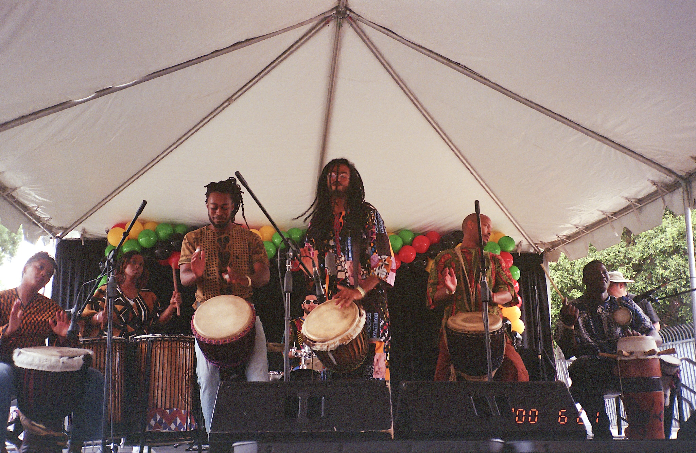

# The Mafé Ensemble Website

A professional website for The Mafé Ensemble — a West African drum collective based in Leimert Park, Los Angeles.

## 🚀 Quick Start (Get Online in 5 Minutes)

### Step 1: Add Your Photos

You need **7 photos total**:

1. **Hero background** — Your best group performance photo (wide, landscape)
   - Edit `styles.css`, find `.hero__bg` and change the background-image line
   
2. **About section** — Ensemble photo or action shot
   - Replace the placeholder div in `index.html` with an `` tag
   
3. **Gallery photos (5)** — Mix of performance and teaching photos
   - Replace each placeholder div in the Gallery section with `` tags

### Step 2: Create Images Folder

Create a folder called `images/` in this directory and put your photos there:

```
images/
  hero-group.jpg
  about-ensemble.jpg
  gallery-1.jpg
  gallery-2.jpg
  gallery-3.jpg
  gallery-4.jpg
  gallery-5.jpg
  social-preview.jpg (for when shared on social media)
```

### Step 3: Update Photo References

**For Hero Background (in styles.css):**
```css
.hero__bg {
  background-image: url('./images/hero-group.jpg');
}
```

**For About Section (in index.html):**
Replace this:
```html
<div class="placeholder-image">
  <span>Ensemble Photo</span>
</div>
```

With this:
```html

```

**For Gallery (in index.html):**
Replace each placeholder with:
```html

```

### Step 4: Deploy to Netlify (Free)

1. Go to <https://netlify.com> and sign up (free)
2. Drag this entire folder onto the Netlify dashboard
3. Your site is live instantly!
4. Optional: Connect your custom domain

### Step 5: Form Notifications

The contact form works automatically on Netlify. To receive emails:

1. In Netlify dashboard → Site settings → Forms
2. Add a notification → Email notification
3. Enter: `Contact@TheMafeEnsemble.com`
4. Done! Form submissions will email you

## 📁 File Structure

```
├── index.html          # Main website
├── styles.css          # All styling
├── script.js           # Animations and interactions
├── success.html        # Thank you page after form submit
└── images/             # Your photos go here
```

## ✏️ Easy Edits (No Coding Needed)

### Change Text
Open `index.html` in any text editor (TextEdit, Notepad, etc.) and edit the text between the tags.

Example:
```html
<p>This is the text you can edit</p>
```

### Change Colors
Open `styles.css` and look for:
```css
:root {
  --terracotta: #C75B2E;  /* Change this color code */
}
```

### Update Contact Info
Search for `Contact@TheMafeEnsemble.com` in `index.html` and replace with your actual email.

## 🎨 Design Notes

- **Colors**: Black (#0A0A0A), White (#FFFFFF), Terracotta (#C75B2E)
- **Font**: Inter (loaded from Google Fonts)
- **Mobile-friendly**: Works on phones, tablets, and desktop
- **Fast**: Optimized for quick loading

## 🆘 Need Help?

Contact your designer or developer for:
- Adding more pages
- Custom animations
- E-commerce for merch
- Blog functionality

---

Built with care for The Mafé Ensemble 🥁
